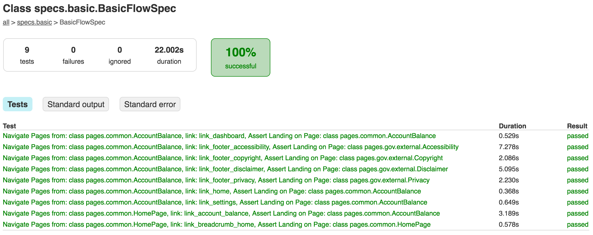
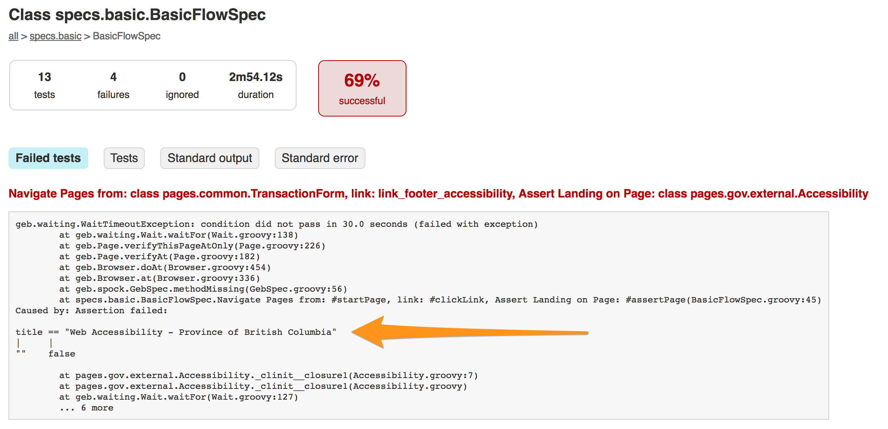

# navUnit - Functional Testing Framework

### Introduction
navUnit lets you navigate through your HTML based application by specifying a starting page, the link to click on, and finally assert that the page being navigated to is correct.

This framework has been designed to be extremely basic in design, simple to use and administer, and most of all easy to incorporate within any Web Based Application project.
 
Goals:
  - Assert that links and buttons found on a web page do not produce "broken links" and do navigate to the correct pages
  - Keep the framework simple by not assert data quality
  - Do not incorporate complex logic or knowledge about the application it is testing
  - Keep the Functional Testing Framework outside of the application implementation to ensure the testing framework can be hardened and enriched outside of the lifecycle of the application it is testing

 ----

## Acknowledgement 
The functional test framework contained here was based on those developed by the BC Government Transportation Fuels Reporting System project, available at the following URL:

https://github.com/bcgov/tfrs

----
## Framework Background
This framework leverages 
1. Geb Browser Automation Framework (http://www.gebish.org/)

> It brings together the power of WebDriver, the elegance of jQuery content selection, the robustness of Page Object modelling and the expressiveness of the Groovy language.

> Page Object Model is a design pattern to create Object Repository for web UI elements.
  Under this model, for each web page in the application, there should be corresponding page class.
  This Page class will find the WebElements of that web page and also contains Page methods which perform operations on those WebElements.
 
2. Spock Framework
   Behaviour-Driven Development (http://spockframework.org/)

----

## Usage

The following commands will launch the tests with the individual browsers:

    ./gradlew chromeTest
    ./gradlew phantomJsTest
    
NOTE: ***Use phantomjsTest when configuring the OpenShift Pipeline***
----   

## Getting Started

Within this section the reader will gain insight on how to get started with this framework.

### Conventions
The HTML User Interface has design has adopted the following conventions to make any clickable element discoverable, and any page assertable:
 
1) all elements that you would like "clickable" (images, links, buttons, column headers, etc) must have the HTML "id" attribute specified.

*example:*

`<a id="link_home" href="#">Home</a>`

2) All pages will contain a unique HTML title (do not share a title across pages)

*example:*

`<title>Unique Title Here</title>`

### Define Pages

As mentioned above this framework leverages the Page Object Model Pattern to reduce the brittleness of functional testing, and increase the expressiveness of functional testing

Each page you would like to be able Assertions on need to be defined as follows:
```
class AccountBalance extends Page {

    static url = '<url>'
    static at = {title == "<page title>"}

}
```

Where the ***'url'*** is the relative path to the Base Url of the application

Where the ***'at'*** is the way to uniquely identify the page from all other pages in the application ***see conventions section above* 

----

### Update Navigation Flows

The defining of a flow is simple and and descriptive.  
Anatomy of a test flow 

1. starts with a starting page ***startPage*** (where the test scenario starts from)
2. select the clickable element on the page ***clickLink*** (the element "id" on the page that the navigation will click on)
3. define the ***clickCount*** (then number of times you require the navigation to click on the link - useful for asserting column sorting where you would like to test ascending and descending column sorting)
4. define the ***timeoutSeconds*** (amount of time the page should return with a result)
5. define the final page assertion point ***assertPage*** (where the end of the flow should finally land on a given page)


----
## Generated Reports
The following is an exaple of the report that will be generated at the completion of the Funcation Test Execution:

### Successful Execution Example (no issues):


### Failure Execution Example (with issues):
